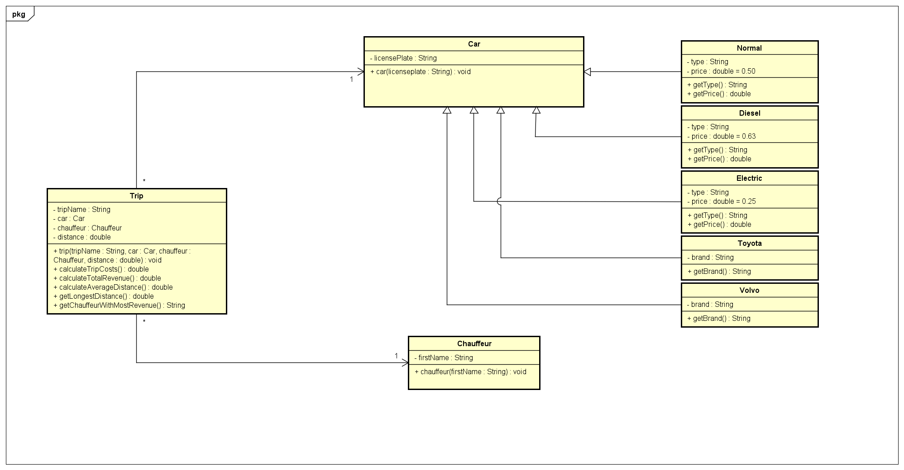

# Startdocument for BOLT

## Startdocument of Chris Klunder. Student number 5051053.

# Problem Description 
`Het bedrijf BOLT is een bedrijf die het mogelijk maakt om via een App een auto aan te vragen en naar een bestemming toe te rijden. Aan de hand van het aantal kilometer, het soort auto wordt er een bedrag berekend die de klant moet betalen.`

`Bolt maakt alleen maar gebruik van auto’s van het merk Toyota en Volvo. Alle auto’s hebben een chauffeur.`

`Deze chauffeur heeft altijd een voornaam, mocht er geen voornaam opgegeven worden of alleen maar spaties, krijgt de chauffeur een standaardnaam “BoltDriver”.`

`De auto’s hebben een merk en een Nederlandse kentekenplaat (formaat: 999-XX-9, drie cijfers, twee hoofdletters en nog een cijfer) Als de cijfers van de kentekenplaat niet voldoen komt er in de kentekenplaat -1 te staan op de plaats van de cijfers. Mochten de letters niet voldoen wordt dit null. Maak het zo dat kleine letters ook geaccepteerd worden.`

`Er zijn drie verschillende soorten auto’s die gereserveerd kunnen worden. Een gewone auto, deze heeft een prijs van 50 cent per kilometer. Een elektrische auto, deze heeft een prijs van 25 cent per kilometer en een dieselauto waarvoor niet alleen een prijs van 63 cent per kilometer geldt, maar ook een milieutoeslag van 3 euro per 10 kilometer. De ritten worden per kilometer afgerekend.`

`Bolt wil graag de volgende dingen:`

`Per rit het te betalen bedrag;
De totale inkomsten van alle auto’s;
De gemiddelde afstand van alle auto’s;
De rit met de langste afstand (Als er meer langste ritten zijn, geef dan de meest recente terug;
De chauffeur met de meeste omzet (Als er meer met dezelfde omzet zijn, maakt het niet uit welke teruggegeven wordt).`

Make sure you application is well documented with Javadoc. Make sure it is Unit tested as well.

# Input & Output
In this section the in- and output of the application will be described.

## Input
In the table below all the input (that the user has to input in order to make the application work) are described.
<table>
    <thead>
        <tr>
            <th>Case</th>
            <th>Type</th>
            <th>Conditions</th>
        </tr>
    <thead>
    <tbody>
        <tr>
            <td>firstName</td>
            <td>String</td>
            <td>no number</td>
        </tr>
        <tr>
            <td>licensePlate</td>
            <td>String</td>
            <td>Format(999-XX-9)</td>
        </tr>
    </tbody>
<table>

## Output

<table>
    <thead>
        <tr>
            <th>Case</th>
            <th>Type</th>
        </tr>
    <thead>
    <tbody>
        <tr> 
            <td>List of trips</td>
            <td>HashSet<"Trips"></td>
        </tr>
        <tr> 
            <td>The costs of a trip</td>
            <td>double</td>
        </tr>
        <tr> 
            <td>The total revenue</td>
            <td>double</td>
        </tr>
        <tr> 
            <td>The average distance per trip</td>
            <td>double</td>
        </tr>
        <tr> 
            <td>The trip with the longest distance</td>
            <td>String</td>
        </tr>
        <tr> 
            <td>The chauffeur with the most revenue</td>
            <td>String</td>
        </tr>
    </tbody>
<table>

## Calculations

<table>
    <thead>
        <tr>
            <th>Case</th>
            <th>Calculation</th>
        </tr>
    <thead>
    <tbody>
        <tr>
            <td>The costs of a trip</td>
            <td>The car type times the price per kilometer + an additional 3 euro per 10 kilometers for diesel cars</td>
        </tr>
        <tr>
            <td>The total revenue</td>
            <td>Get the total of all the trip costs combined</td>
        </tr>
        <tr>
            <td>The average distance per trip</td>
            <td>Divide the total distance travelled during all trips by the amount of trips that have been made</td>
        </tr>
    </tbody>
<table>

## Remarks
<ul>
    <li>Input will be validated.</li>
    <li>Unit Tests will be provided.</li>
</ul>

# Class Diagram

# Testplan
In this section the testcases will be described to test the application.

# Test Data

In the following table you'll find all the data that is needed for testing.

## Car

<table>
    <thead>
        <tr>
            <th>ID</th>
            <th>Input</th>
            <th>Code</th>
        </tr>
    <thead>
    <tbody>
        <tr> 
            <td><code>123-XA-9</code></td>
            <td>licensePlate: 123-XA-9</td>
            <td><code>new Car("123-XA-9")</code></td>
        </tr>
        <tr> 
            <td><code>578-PQ-0</code></td>
            <td>licensePlate: 578-PQ-0</td>
            <td><code>new Car("578-PQ-0")</code></td>
        </tr>
    </tbody>
</table>

## Chauffeur

<table>
    <thead>
        <tr>
            <th>ID</th>
            <th>Input</th>
            <th>Code</th>
        </tr>
    <thead>
    <tbody>
        <tr> 
            <td><code>Peter</code></td>
            <td>firstName: Peter</td>
            <td><code>new Chauffeur("Peter")</code></td>
        </tr>
        <tr> 
            <td><code>Alfred</code></td>
            <td>firstName: Alfred</td>
            <td><code>new Chauffeur("Alfred")</code></td>
        </tr>
    </tbody>
</table>

## Trip

<table>
    <thead>
        <tr>
            <th>ID</th>
            <th>Input</th>
            <th>Code</th>
        </tr>
    <thead>
    <tbody>
        <tr> 
            <td>Trip1</td>
            <td>tripName: Trip1 
                car: 123-XA-9 
                chauffeur: Peter 
                distance: 25</td>
            <td><code>new Trip(Trip1, 123-XA-9, 1, 25)</code></td>
        </tr>
        <tr> 
            <td><code>Trip2</code></td>
            <td>tripName: Trip2 
                car: 578-PQ-0 
                chauffeur: Alfred 
                distance: 73</td>
            <td><code>new Trip(Trip2, 578-PQ-0, Alfred, 73)</code></td>
        </tr>
    </tbody>
</table>

# Test Cases
In this section the testcases will be described. Every test case should be executed with the test data as starting point.

## #1 
<table>
    <thead>
        <tr>
            <th>Step</th>
            <th>Input</th>
            <th>Action</th>
            <th>Expected output</th>
        </tr>
    <thead>
    <tbody>
        <tr> 
            <td>1</td>
            <td><code>Toyota</code></td>
            <td><code>getLicensePlate()</code></td>
            <td><code>123-XA-9</code></td>
        </tr>
        <tr> 
            <td>2</td>
            <td><code>123-XA-9</code></td>
            <td><code>getCarType()</code></td>
            <td><code>Diesel</code></td>
        </tr>
        <tr> 
            <td>3</td>
            <td><code>Trip1</code></td>
            <td><code>getDistance()</code></td>
            <td><code>25</code></td>
        </tr>
        <tr> 
            <td>4</td>
            <td><code>Trip1</code></td>
            <td><code>getTripCosts()</code></td>
            <td><code>21,75</code></td>
        </tr>
        <tr> 
            <td>5</td>
            <td><code>Total revenue</code></td>
            <td><code>getTotalRevenue()</code></td>
            <td><code>58,25</code></td>
        </tr>
        <tr> 
            <td>6</td>
            <td><code>Average distance</code></td>
            <td><code>getAverageDistance()</code></td>
            <td><code>49</code></td>
        </tr>
        <tr> 
            <td>7</td>
            <td><code>Longest distance</code></td>
            <td><code>getLongestDistance()</code></td>
            <td><code>73</code></td>
        </tr>
        <tr> 
            <td>8</td>
            <td><code>Chauffeur with most revenue</code></td>
            <td><code>getChauffeurWithMostRevenue()</code></td>
            <td><code>Alfred</code></td>
        </tr>
    </tbody>
<table>

