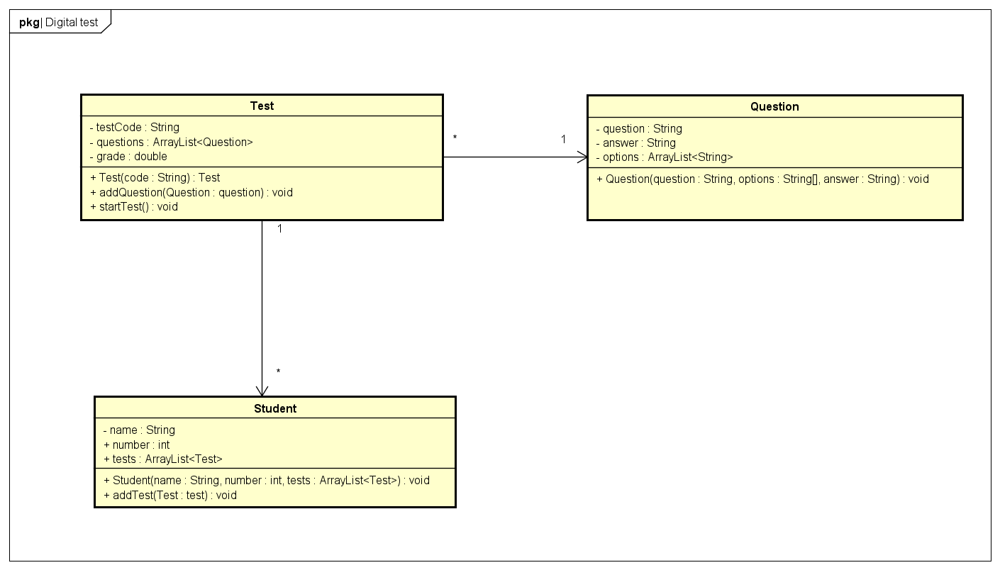

# Startdocument for Digital Testing

## Startdocument of Chris Klunder. Student number 5051053.

# Problem Description

`Om het milieu te besparen wil NHL Stenden het toetsen afnemen
digitaliseren. Een toets bestaat uit meerdere vragen. De vraag
bestaat uit meerdere antwoorden waarvan er een goed is. Als de
vragen zijn toegevoegd moet de toets worden afgenomen. Wanneer
de toets is afgelopen met de score van de toets worden
weergegeven. Als de score hoger is dan 55% heeft de student de
toets gehaald. Het resultaat moet als volgt worden weergegeven: “Je score is 56%. Je hebt de toets gehaald”. Als het resultaat
onvoldoende is moet het volgende worden weergegeven: “Je score
is 54%. Je hebt de toets niet gehaald!”. Het percentage is variabel en hangt af van het daadwerkelijke resultaat.`

Make sure you application is well documented with Javadoc. Make sure it is Unit tested as well.

# Input & Output
In this section the in- and output of the application will be described.

## Input
In the table below all the input (that the user has to input in order to make the application work) are described.
<table>
    <thead>
        <tr>
            <th>Case</th>	
            <th>Type</th>	
            <th>Conditions</th>
        </tr>
    <thead>
    <tbody>
        <tr> 
            <td>name</td>
            <td>String</td>
            <td>not empty</td>
        </tr>
        <tr> 
            <td>number</td>
            <td>integer</td>
            <td>0 < number</td>
        </tr>
        <tr> 
            <td>testCode</td>
            <td>String</td>
            <td>not empty</td>
        </tr>
        <tr> 
            <td>grade</td>
            <td>double</td>
            <td>not empty</td>
        </tr>
        <tr> 
            <td>question</td>
            <td>String</td>
            <td>not empty</td>
        </tr>
        <tr> 
            <td>answer</td>
            <td>String</td>
            <td>not empty</td>
        </tr>
    </tbody>
<table>

## Output

<table>
    <thead>
        <tr>
            <th>Case</th>	
            <th>Type</th>	
        </tr>
    <thead>
    <tbody>
        <tr> 
            <td>Grade</td>
            <td>double</td>
        </tr>
        <tr> 
            <td>List of tests</td>
            <td>ArrayList<"Test"></td>
        </tr>
        <tr> 
            <td>List of questions</td>
            <td>ArrayList<"Question"></td>
        </tr>
        <tr> 
            <td>List of options</td>
            <td>ArrayList<"Option"></td>
        </tr>
    </tbody>
<table>

## Calculations

<table>
    <thead>
        <tr>
            <th>Case</th>	
            <th>Calculation</th>	
        </tr>
    <thead>
    <tbody>
        <tr> 
            <td>Grade</td>
            <td>correctAnswered / questions.size() * 100</td>
        </tr>
    </tbody>
<table>

## Remarks
<ul>
    <li>Input will be validated.</li>
    <li>Only the Main class will contain System.out.println</li>
    <li>Unit Tests will be provided.</li>
</ul>

# Class Diagram

# Testplan
In this section the testcases will be described to test the application.

# Test Data

In the following table you'll find all the data that is needed for testing.

## Test

<table>
    <thead>
        <tr>
            <th>Id</th>	
            <th>Input</th>	
            <th>Code</th>
        </tr>
    <thead>
    <tbody>
        <tr> 
            <td><code>Natuurkunde</code></td>
            <td>code: <code>Natuurkunde</code></td>
            <td><code>new Test("Natuurkunde")</code></td>
        </tr>
    </tbody>
</table>

## Student

<table>
    <thead>
        <tr>
            <th>Id</th>	
            <th>Input</th>	
            <th>Code</th>
        </tr>
    <thead>
    <tbody>
        <tr> 
            <td><code>Chris</code></td>
            <td>name: <code>Chris</code>
                number: <code>1</code></td>
            <td><code>new Student("Chris", 1)</code></td>
        </tr>
    </tbody>
</table>

## Question

<table>
    <thead>
        <tr>
            <th>Id</th>	
            <th>Input</th>	
            <th>Code</th>
        </tr>
    <thead>
    <tbody>
        <tr> 
            <td><code>question1</code></td>
            <td>question: <code>Hoe heet is het oppervlakte van de zon? </code>
                String[] a: <code>{"5.855°C", "6.000°C", "5.115°C", "4.935°C"} </code>
                answer: <code>"6.000°C"</code></td>
            <td><code>new Question("Hoe heet is het oppervlakte van de zon?", {"5.855°C", "6.000°C", "5.115°C", "4.935°C"}, "6.000°C")</code></td>
        </tr>
        <tr> 
            <td><code>question2</td>
            <td>question: <code>Hoe ver is de zon van de aarde? </code>String[] a: <code>{"100 miljoen km", "125 miljoen km", "150 miljoen km", 
            "175 miljoen km"} </code>answer : <code>"150 miljoen km"</code></td>
            <td><code>new Question("Hoe ver is de zon van de aarde?", {"100 miljoen km", "125 miljoen km", "150 miljoen km", 
            "175 miljoen km"}, "6.000°C" )</code></td>
        </tr>
        <tr> 
            <td><code>question3</td>
            <td>question: <code>"Hoeveel keer zo groot is de zon ten opzichte van de maan?" </code>String[] a: <code>{"400 keer", "500 keer", "600 keer", "700 keer"} </code>answer: <code>"400 keer"</code></td>
            <td><code>new Question("Hoeveel keer zo groot is de zon ten opzichte van de maan?", {"400 keer", "500 keer", "600 keer", "700 keer"}, "400 keer")</code></td>
        </tr>
        <tr> 
            <td><code>question4</code></td>
            <td>question: <code>"Wat is de zwaartekracht op de zon?" </code>String[] a: <code>{"234m/s²", "217m/s²", "274m/s²", "321m/s²"} </code>answer: <code>"274m/s²"</code></td>
            <td><code>new Question("Wat is de zwaartekracht op de zon?", {"234m/s²", "217m/s²", "274m/s²", "321m/s²"}, "274m/s²")</code></td>
        </tr>
        <tr> 
            <td><code>question5</code></td>
            <td>question: <code>"Wat is het oppervlakte van de aarde?" </code>String[] a: <code>{"483 miljoen km²", "517 miljoen km²", "499 miljoen km²" ,
            "510 miljoen km²"} </code>answer: <code>"510 miljoen km²"</code></td>
            <td><code>new Question("Wat is het oppervlakte van de aarde?", {"483 miljoen km²", "517 miljoen km²", "499 miljoen km²" ,
            "510 miljoen km²"}, "510 miljoen km²")</code></td>
        </tr>
    </tbody>
</table>

# Test Cases
In this section the testcases will be described. Every test case should be executed with the test data as starting point.

## #1 Get Score
<table>
    <thead>
        <tr>
            <th>Step</th>	
            <th>Input</th>	
            <th>Action</th>
            <th>Expected output</th>
        </tr>
    <thead>
    <tbody>
        <tr> 
            <td>1</td>
            <td><code>Chris</code></td>
            <td><code>getNumber()</code></td>
            <td><code>1</code></td>
        </tr>
        <tr> 
            <td>2</td>
            <td><code>Hoe heet is het oppervlakte van de zon?</code></td>
            <td><code>getOptions()</code></td>
            <td><code>{"5.855°C", "6.000°C", "5.115°C", "4.935°C"}</code></td>
        </tr>
        <tr> 
            <td>3</td>
            <td><code>Hoe ver is de zon van de aarde?</code></td>
            <td><code>getOptions()</code></td>
            <td><code>{"100 miljoen km", "125 miljoen km", "150 miljoen km", 
            "175 miljoen km"}</code></td>
        </tr>
        <tr> 
            <td>4</td>
            <td><code>Hoeveel keer zo groot is de zon ten opzichte van de maan?</code></td>
            <td><code>getOptions()</code></td>
            <td><code>{"400 keer", "500 keer", "600 keer", "700 keer"}</code></td>
        </tr>
        <tr> 
            <td>5</td>
            <td><code>"Wat is de zwaartekracht op de zon?"</code></td>
            <td><code>getOptions()</code></td>
            <td><code>{"234m/s²", "217m/s²", "274m/s²", "321m/s²"}</code></td>
        </tr>
        <tr> 
            <td>6</td>
            <td><code>"Wat is het oppervlakte van de aarde?"</code></td>
            <td><code>getOptions()</code></td>
            <td><code>{"483 miljoen km²", "517 miljoen km²", "499 miljoen km²" ,
            "510 miljoen km²"}</code></td>
        </tr>
        <tr> 
            <td>7</td>
            <td><code>Insert answers</code></td>
            <td><code>scan.nextInt</code></td>
            <td><code>ArrayList<'String'> answers</code></td>
        </tr>
        <tr> 
            <td>8</td>
            <td><code>Check answers</code></td>
            <td><code>correctAnswerIndex()</code></td>
            <td><code>3</code></td>
        </tr>
        <tr> 
            <td>9</td>
            <td><code>Grade test</code></td>
            <td><code>correctAnswered / questions.size() * 100</code></td>
            <td><code>60%</code></td>
        </tr>
    </tbody>
<table>

